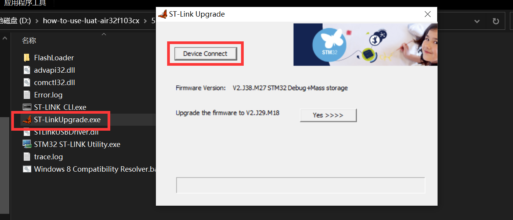
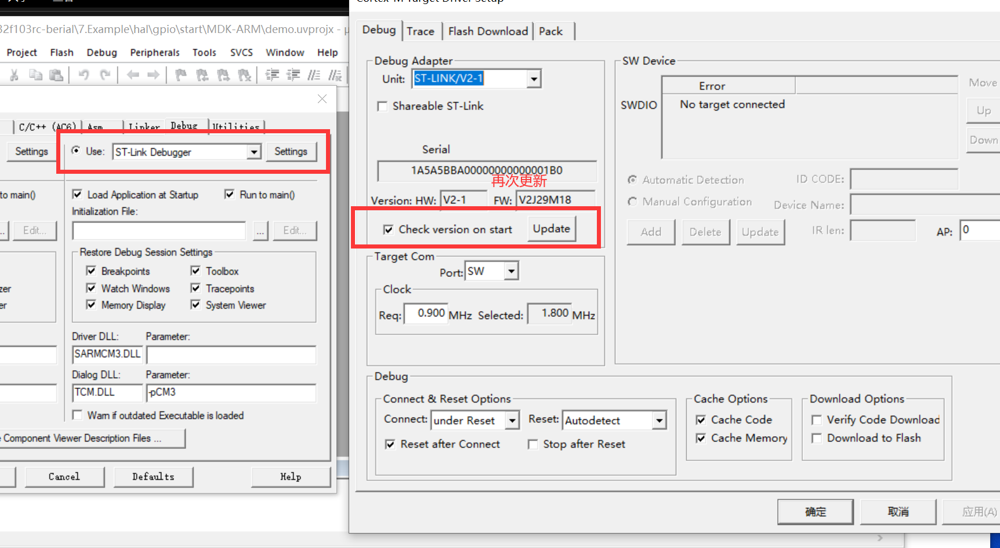
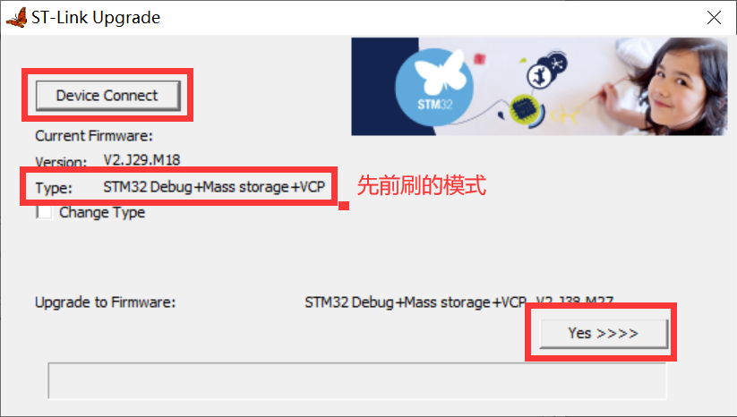
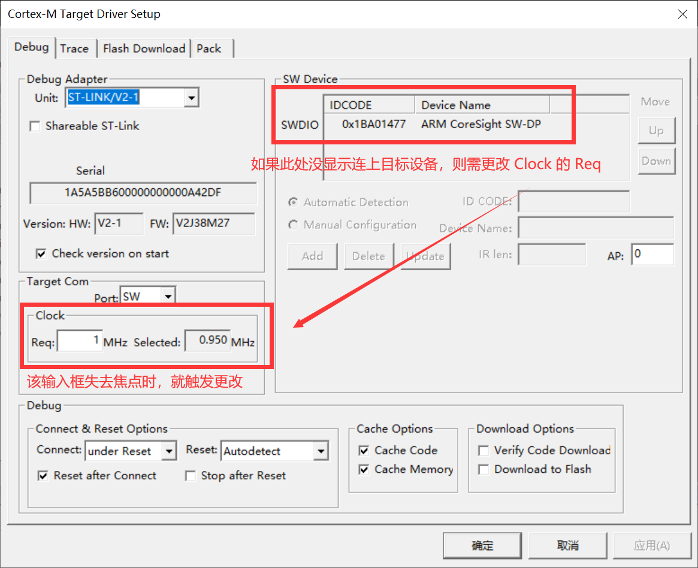

此处需要两个 daplink，即一个 daplink 将另一个 daplink 刷成 stlink.

如果刷的是开发板，可将按住 BOOT，按下 RST 然后松开 RST，再松开 BOOT，再刷固件。

刷完后使用  ST-Link Upgrade 升级下 stlink，模式自选即可。（注：ST-LInk 需装驱动才能用）

然后再 keil 里的 ST-link Debugger 里再次更新。

更新完成后，连接目标芯片

